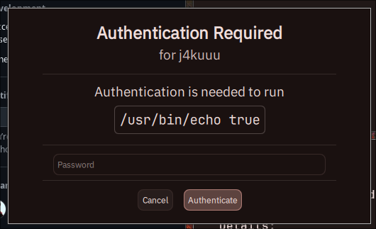

# hyprpolkitagent
A simple polkit authentication agent for Hyprland, written in QT/QML.

## Roadmap / TODO

### Core UX / flow
- [ ] Use PAM request text for the prompt (not always "Password")
- [ ] Surface PAM info/error messages in the UI
- [ ] Disable Authenticate until input is present; reset input on failure
- [ ] Better retry UX (clear field, refocus, visible error)
- [ ] Password visibility toggle (show/hide)
- [ ] Caps Lock warning on the password field

### Identity handling
- [ ] Prefer the current user when multiple identities are supplied
- [ ] Optional user selector when multiple admin identities are available (extra)

### Robustness
- [x] Queue concurrent requests instead of rejecting them
- [ ] Consistent cleanup on cancel/timeout
- [ ] Avoid showing prompts while the session is locked (if applicable)

### Security / privacy
- [ ] Secure/zeroized password buffer (best-effort in Qt)
- [ ] Avoid clipboard exposure; clear buffers on close

### Optional transparency / polish (extras)
- [ ] Expandable "Details" section (action id, vendor, vendor URL)
- [ ] "Remember authorization" only if policy supports it; document tradeoffs
- [ ] Action/app icon support (use iconName/details when present)
- [ ] User avatar display (if available)
- [ ] Multi-monitor placement (center on active monitor / requester)
- [ ] Full i18n (Qt translations)

## Usage

See [the hyprland wiki](https://wiki.hyprland.org/Hypr-Ecosystem/hyprpolkitagent/)
