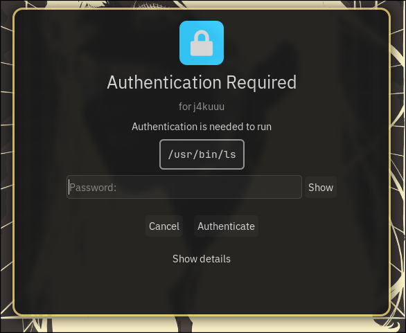

# hyprpolkitagent
A simple polkit authentication agent for Hyprland, written in C++ with [hyprtoolkit](https://github.com/hyprwm/hyprtoolkit).

## Features

### Core UX / flow
- [x] Uses PAM request text for the prompt (not always "Password")
- [x] Surfaces PAM info/error messages in the UI
- [x] Dims Authenticate until input is present
- [x] Retry on auth failure (restarts PAM session, shows error)
- [x] Password visibility toggle (show/hide)
- [x] Caps Lock warning on the password field

### Identity handling
- [x] Prefers the current user when multiple identities are supplied
- [x] User selector when multiple admin identities are available

### Robustness
- [x] Queues concurrent requests instead of rejecting them
- [x] Consistent cleanup on cancel (cancels running PAM session)
- [x] Refuses to prompt while the session is locked (logind `LockedHint`)

### Transparency
- [x] Expandable "Details" section (action id, vendor, vendor URL, extras)
- [x] Action/app icon support (uses `iconName`, falls back to system theme)

### Window placement
Window positioning under Wayland (xdg-shell) is decided by the compositor, so
the agent does not attempt to set absolute coordinates. Hyprland centers
floating dialogs by default.

## Usage

See [the hyprland wiki](https://wiki.hyprland.org/Hypr-Ecosystem/hyprpolkitagent/)
